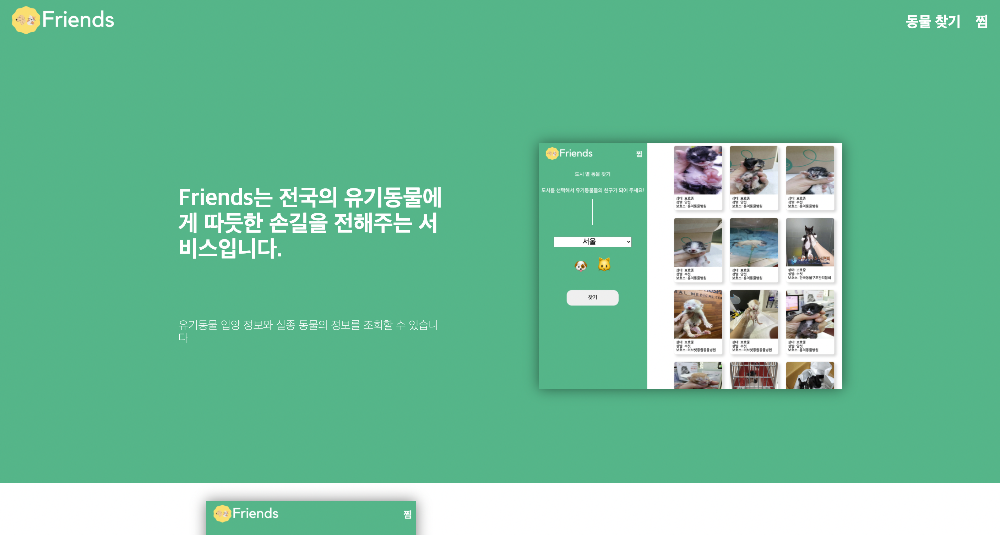

# 🐶🐱 Friends

 

### 각 지역의 유기동물 입양 정보와 실종 동물의 정보를 조회할 수 있는 서비스입니다.

---

'반려동물 사지말고 입양합시다' 라는 말을 많이들 들어봤으나 어디서 정보를 찾고 어떻게 입양을 해야하는지 모르시는 분들이 많습니다.
 

Friends에서는 전국의 유기동물과 보호소의 정보를 얻을 수 있습니다.
 

Friends는 전국의 유기동물에게 따듯한 손길을 전해주고자 합니다.
 
 

 

## ⏰ 개발 기간

---

 

- 2021-07-28 ~ 2021-09-09 (1개월 13일)
- 이후 백엔드와의 협업 등 계속해서 추가 할 예정 💡

 
 

## 📒 프로젝트 노션 링크

---

 

[프로젝트 소개 노션 링크](https://friends-us.netlify.app/)

 
 

## 🏠 배포 사이트

---

 

[https://friends-us.netlify.app/](https://friends-us.netlify.app/)

 
 

## ⚙️ 개발 스택

---

 

- 프론트
  - React
  - Redux + Saga
  - TypeScript
  - Styled-Components

 

- 백엔드
  - 추가 예정

 
 

## 🔨 트러블 슈팅

---

 

- 추가 예정

 
 
